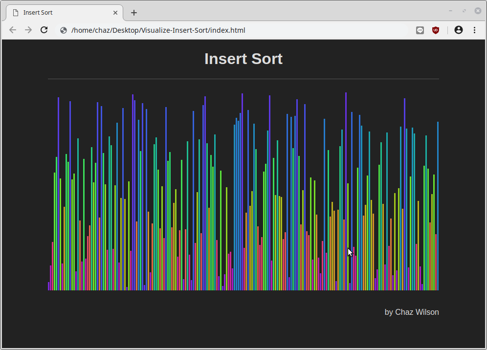
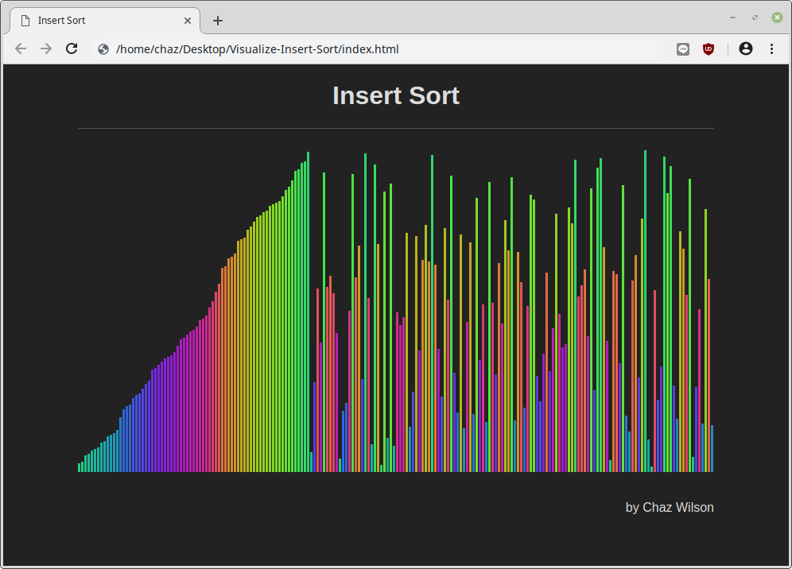
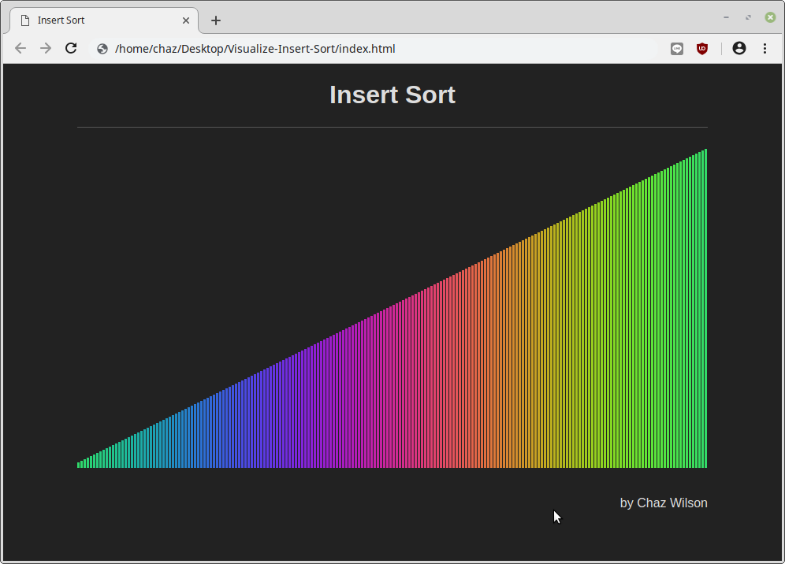

# Visualize-Insert-Sort

This is a simple visualization of a sorting algorithm, insert sort.

Instructions to download and view:

* `git clone https://github.com/chaz303/Visualize-Insert-Sort.git`
* `cd ./Visualize-Insert-Sort/`
* `google-chrome ./index.html`

For extra fun, try slowly moving the mouse back and forth over the image as it is sorting.

