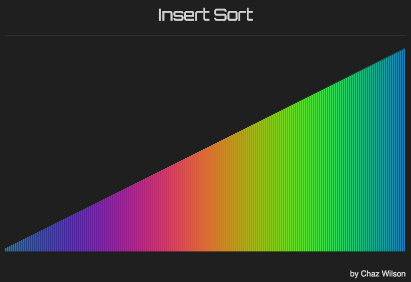
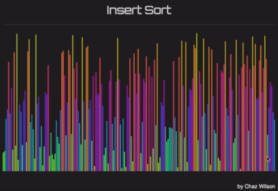

 Visualize Insert Sort

This is a simple visualization of a sorting algorithm, insert sort. It is written Javascript, without the use of any libraries.

## Instructions to download and view:

* `git clone https://github.com/chaz303/visualize-insert-sort.git`
* `cd ./visualize-insert-sort/`
* `google-chrome ./index.html`

## Instructions for use:

* Click on the colored bars to scramble and sort them.
* Move the cursor back-and-forth over the colored bars as they are being sorted.
* Repeat.

<table width="width:100%">
 <tr><td colspan="2">

 </td></tr>
  <tr>
   <td align="center"> <b>without cursor movement</b></td>
    <td align="center"> <b>with cursor movement</b></td>
   <tr>
 </table>

